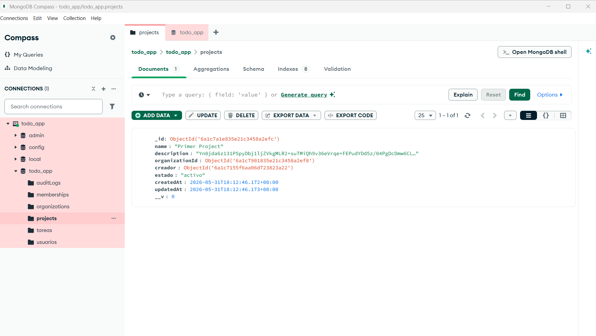
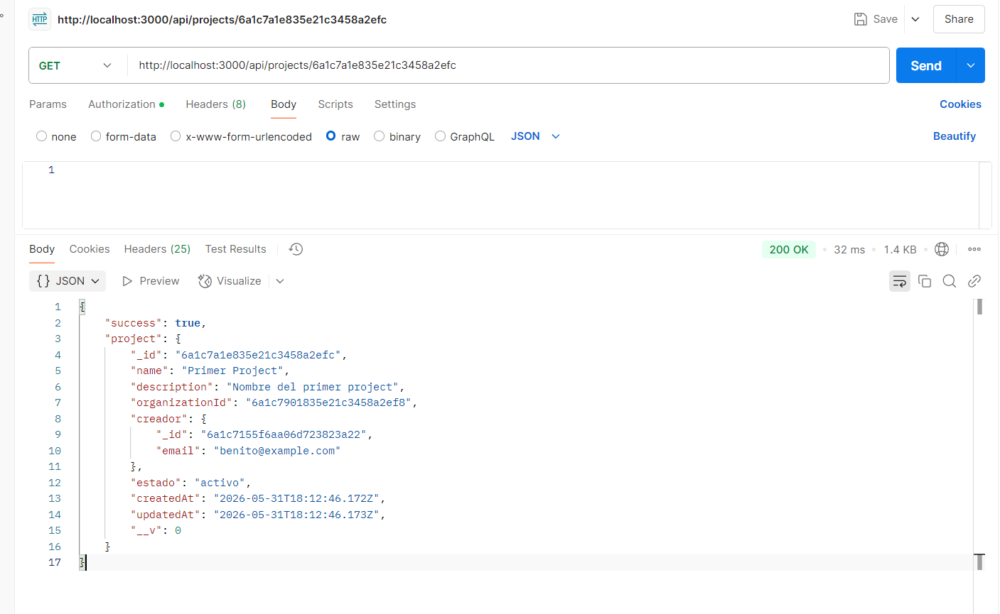
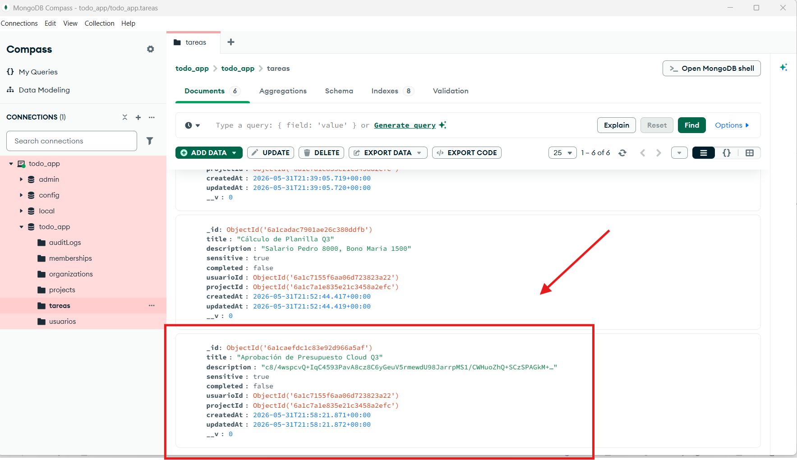

# Evidencias - Clase 12: Cifrado en Reposo con AES-256-GCM

## Implementación

Se ha implementado el cifrado en reposo con AES-256-GCM en el proyecto SecureCollab según los criterios especificados.

### Archivos Creados/Modificados:

1. **src/security/encryption.js** - Módulo de encriptación con funciones encrypt() y decrypt()
   - Algoritmo: AES-256-GCM
   - IV: 12 bytes (generado aleatorio por cada encriptación)
   - Auth Tag: 16 bytes (para verificar integridad)
   - Clave: 32 bytes (256 bits) desde ENCRYPTION_KEY en .env
   - Formato almacenado: base64(IV || authTag || ciphertext)

2. **src/models/project.model.js** - Nuevo modelo Project
   - La descripción se cifra SIEMPRE con AES-256-GCM
   - Se descifra automáticamente al leer mediante post-hooks de Mongoose
   - En MongoDB: base64 ilegible
   - Vía API: texto plano

3. **src/models/tarea.model.js** - Modelo Task modificado
   - Campo `sensitive` (boolean) controla si cifrar
   - Si sensitive=true: descripción cifrada en BD, descifrada en API
   - Si sensitive=false: descripción en plano tanto en BD como en API

4. **.env** - Configuración con ENCRYPTION_KEY
   - Clave generada: 64 caracteres hexadecimales (32 bytes)
   - **NOTA:** Este archivo NO se sube a git

5. **.env.example** - Placeholder para ENCRYPTION_KEY
   - Subido a git con valor de ejemplo
   - Instrucciones para generar nueva clave

## Verificación Manual

Para verificar el funcionamiento, realizar los siguientes pasos:

### Paso 1: Crear un Proyecto con Descripción

```bash
curl -X POST http://localhost:3000/api/organizations/<ORG_ID>/projects \
  -H "Authorization: Bearer <TOKEN>" \
  -H "Content-Type: application/json" \
  -d '{
    "name": "Confidencial",
    "description": "Plan estratégico Q3"
  }'
```

**Respuesta esperada:**
```json
{
  "success": true,
  "project": {
    "_id": "...",
    "name": "Confidencial",
    "description": "Plan estratégico Q3",
    ...
  }
}
```

### Paso 2: Ver el Documento Cifrado en MongoDB

Abrir MongoDB Compass y navegar a `todo_app.projects`. El documento debe mostrar:
- `description`: Un string en base64 ilegible (ej: `aB3xK2m9nP8...`)

Ejemplo de cómo se ve en BD:
```
{
  "_id": ObjectId("..."),
  "name": "Confidencial",
  "description": "aB3xK2m9nP8qR5sT7uV9wX2yZ4aB6cD8eF0gH2iJ4kL6mN8oP0qR2sTuVwXyZ1aB3cD5...",
  ...
}
```

### Paso 3: Leer el Proyecto por la API

```bash
curl -X GET http://localhost:3000/api/projects/<PROJECT_ID> \
  -H "Authorization: Bearer <TOKEN>"
```

**Respuesta esperada:**
```json
{
  "success": true,
  "project": {
    "_id": "...",
    "name": "Confidencial",
    "description": "Plan estratégico Q3",
    ...
  }
}
```

La descripción se muestra en texto plano porque los post-hooks de Mongoose desencriptan automáticamente.

### Paso 4: Crear una Tarea Sensible (Cifrada)

```bash
curl -X POST http://localhost:3000/api/projects/<PROJECT_ID>/tasks \
  -H "Authorization: Bearer <TOKEN>" \
  -H "Content-Type: application/json" \
  -d '{
    "title": "Diseño",
    "sensitive": true,
    "description": "Salario Pedro 8000"
  }'
```

**En MongoDB:** La descripción será un string en base64 ilegible
**Vía API GET:** La descripción será "Salario Pedro 8000"

### Paso 5: Crear una Tarea NO Sensible (Plano)

```bash
curl -X POST http://localhost:3000/api/projects/<PROJECT_ID>/tasks \
  -H "Authorization: Bearer <TOKEN>" \
  -H "Content-Type: application/json" \
  -d '{
    "title": "Otra",
    "sensitive": false,
    "description": "Comprar café"
  }'
```

**En MongoDB:** "description": "Comprar café"
**Vía API GET:** "description": "Comprar café"

## Seguridad

- **Confidencialidad:** Sin ENCRYPTION_KEY no se puede leer los datos cifrados
- **Integridad:** El auth tag de GCM detecta cualquier alteración en el ciphertext
- **Clave segura:** Almacenada en .env (nunca en git ni en código)
- **IV único:** Se genera aleatorio en cada encriptación (previene ataques de patrón)

## Instrucciones para Verificación Manual

### Para tomar screenshots:

**Screenshot 1: Proyecto con descripción cifrada en MongoDB Compass**
1. Abrir MongoDB Compass
2. Conectar a `mongodb://localhost:27017`
3. Navegar a BD `todo_app` → colección `projects`
4. Seleccionar el documento creado
5. En el campo `description`, se verá un string base64 como: `aB3xK2m9nP8qR5sT7uV9...`
6. Tomar screenshot mostrando el campo cifrado



**Screenshot 2: Mismo proyecto via API GET mostrando descripción descifrada**
1. Abrir Postman o cliente similar
2. GET `http://localhost:3000/api/projects/<PROJECT_ID>`
3. Header: `Authorization: Bearer <TOKEN>`
4. Response mostrará `"description": "Plan estratégico Q3"` (texto plano)
5. Tomar screenshot del JSON response



**Screenshot 3: Tarea sensible con descripción cifrada**
1. En MongoDB Compass, ir a colección `tareas`
2. Filtrar por `sensitive: true`
3. Ver que `description` sea base64 ilegible
4. Tomar screenshot mostrando el cifrado



**Curl equivalente para verificar**
```bash
# Leer proyecto (descripción se descifra automáticamente)
curl -X GET http://localhost:3000/api/projects/<PROJECT_ID> \
  -H "Authorization: Bearer <TOKEN>" | jq '.project.description'

# Resultado: "Plan estratégico Q3"
```

## Pruebas Recomendadas

1. Crear proyecto y verificar cifrado en MongoDB Compass
2. Leer proyecto por API y verificar descifrado
3. Crear tarea sensible y verificar cifrado
4. Crear tarea normal y verificar almacenamiento plano
5. Intentar modificar manualmente el ciphertext en MongoDB → el descifrado debe fallar con error de integridad
